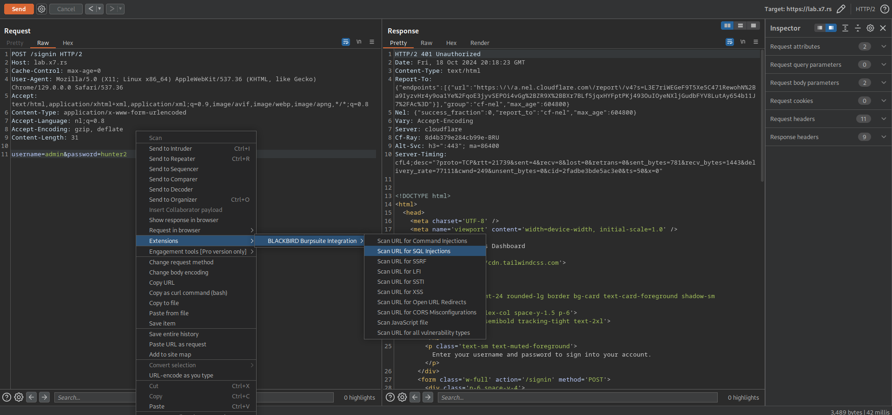

# BLACKBIRD Burpsuite Integration

This Burp Suite extension integrates BLACKBIRD Web App Pentesting Suite with Burp Suite, allowing you to seamlessly scan your targets for various security vulnerabilities directly from your Burp Suite interface.

## Features

- Scan URLs for all security vulnerabilities with 1 click
- Scan URLs for multiple security vulnerabilities:
  - Command Injections
  - SQL Injections
  - Server-Side Request Forgery (SSRF)
  - Local File Inclusion (LFI)
  - Server-Side Template Injection (SSTI)
  - Cross-Site Scripting (XSS)
  - Open URL Redirects
  - CORS Misconfigurations
- Audit JavaScript files
- Configurable API key, timeout, and delay settings
- Easy-to-use interface within Burp Suite

For a more comprehensive list of supported security vulnerabilities visit our website: [https://blackbirdsec.eu/](https://blackbirdsec.eu/?ref=github)

## Installation

1. Download the latest `blackbird-burpsuite-integration.py` file from the [releases page](https://github.com/blackbird-eu/blackbird-burpsuite-integration/releases).
2. In BurpSuite, go to the "Extensions" tab.
3. Click on "Add" in the "Burp extensions" section.
4. Set the "Extension type" to "Python".
5. Select the downloaded `blackbird-burpsuite-integration.py` file.
6. Click "Next" and then "Close".

## Configuration

1. After installation, go to the "BLACKBIRD Burpsuite Integration" tab in Burp Suite.
2. Enter your BLACKBIRD API key in the "API Key" field.
3. (Optional) Adjust the timeout and delay settings if needed.
4. Click "Save" to store your settings.

## Usage

1. Right-click on a request in any Burp Suite tool (e.g., Target, Proxy).
2. In the context menu, you'll see various "Scan URL for..." options.
3. Select the desired scan type.
4. The plugin will send the request to the BLACKBIRD API for scanning.
5. Check your BLACKBIRD dashboard at https://app.blackbirdsec.eu/signin for your scan results.

## Getting Your API Key

1. Log in to your BLACKBIRD account at https://app.blackbirdsec.eu/signin.
2. Navigate to your profile page at https://app.blackbirdsec.eu/profile.
3. Create a new API key and copy it from the profile page.

## Support

For any issues or feature requests, please send us an email at [support@blackbirdsec.eu](support@blackbirdsec.eu).

## License

This project is licensed under the MIT License - see the [LICENSE](LICENSE) file for details.

## Disclaimer

This tool is intended for use in authorized security testing only. Always ensure you have permission before scanning any targets. Read our [Privacy Policy](https://blackbirdsec.eu/privacy-policy) and our [Terms and Conditions](https://blackbirdsec.eu/terms-and-conditions)
